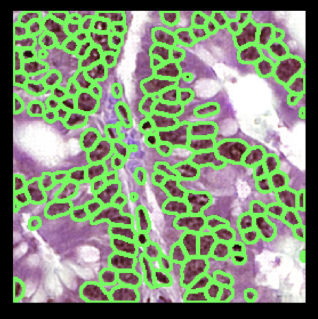

# Perform instance segmentation on virtual H&E using pretrained hovernets that only perform instance segmentation (no classification)



# Note:
The weights are not currently public. The weights are only accessible to members of the MASI Lab.

This image is an example of a CoNIC patch (after style transfer to our virtual H&E style using https://github.com/MASILab/he_stain_translation_cyclegan).
The segmentation was performed using the patch/tile approach given below for CoNIC.
The predicted instance segmentation of the nuclei is shown as contours, but the output is actually a JSON file

We adapted this repo from the hovernet repo: https://github.com/vqdang/hover_net

For the MASI lab, example data, weights, paths etc. have been set up.

If you are in MASI lab, to perform inference on an example whole slide image of virtual H&E, you can just run:

```bash run_wsi_vhe.sh```

And to perform inference examples of style transferred CoNIC (to look like virtual H&E stain style), you can just run:

```bash run_tile_st_conic.sh```

If you are outside of the lab, you can change the paths in those scripts to match where your data is.

# Citations
If you use this repo, please cite:

- the relevant papers from the source repo, (we adapted this code) : https://github.com/vqdang/hover_net
- "Data-driven Nucleus Subclassification on Colon H&E using Style-transferred Digital Pathology"

# Data format
Please follow the original hovernet repo for guiding how to format data.

# Pretrained weights
The weights for 5 folds of trained hovernets for nucleus instance segmentation on virtual H&E can be found here:

**MASI Lab:** ```/nfs/masi/remedilw/paper_journal_nucleus_subclassification/nucleus_subclassification/weights```

**Public:** Not currently available

